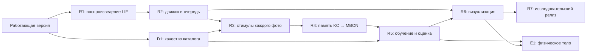

# Fly Estate: план следующей версии

Обновлено 28 сентября 2026. Основа — исследовательский документ пользователя и проверенные первоисточники. Статус этого документа: **план работ**. Даты — рабочие ориентиры; переход к следующему исследовательскому этапу зависит от результатов предыдущего.

## Отправная точка

В [первой версии](https://github.com/Perlitten/Fly-Estate/pull/1) уже работают React-интерфейс, карта, 3D-коннектом, Pure/Cyborg Fly, все фотографии, личные оценки, дуэли, фильтры, импорт и экспорт.

На 28 сентября локально загружена 121 квартира: 1327 доступных снимков обработаны из 1427 опубликованных URL. У пяти объявлений фотографии недоступны; 49 квартир с фото проходят начальные правила. Личные оценки пока пусты.

Текущий движок использует 139 248 аннотированных нейронов, фиксированную положительную матрицу связей и обучаемый выход MBON/CX. Следующая версия добавляет спайковую динамику и изменяемую память KC→MBON. Подробности работающей модели — в [README](../README.md).

## Проверенная основа исследования

| Компонент | Решение для Fly Estate |
| --- | --- |
| Модель Shiu | Воспроизвести исходный LIF-расчёт в Brian2, затем интегрировать через собственный адаптер. В репозитории есть данные v783; его исходная конфигурация использует v630. Версию выбирать явно. [Исходный репозиторий](https://github.com/philshiu/Drosophila_brain_model), [статья](https://www.nature.com/articles/s41586-024-07763-9). |
| fly-api | Использовать демо и исследовательские скрипты как исходный материал интеграции. `FlyEnv`, `stimulate_neurons` и `save_weights` из переданного документа считать эскизами интерфейса нашего адаптера. [Репозиторий](https://github.com/dtch1997/fly-api). |
| Обучение | Первое воспроизведение — опубликованный olfactory→MB эксперимент fly-api на подграфе 8991 LIF-нейронов. Авторы описывают структурные изменения для стабилизации, искусственный коэффициент KC→MBON и упрощённую LTD. Все эти изменения входят в журнал эксперимента. [Отчёт](https://github.com/dtch1997/fly-api/blob/main/experiments/learning/report.md). |
| Выход и движение | Определить валентность по выбранным типам MBON и протоколу. В демонстрации fly-api направление движения задаёт инженерный контроллер. Для квартиры нужны свои критерии и проверка полярности выхода. [Отчёт о навигации](https://github.com/dtch1997/fly-api/blob/main/experiments/navigation/report.md). |
| Ресурсы | Измерить время, RSS, объём данных и число спайков на этом компьютере. Диапазоны RAM и скорости из исходного документа использовать как гипотезы для замеров. Начать с одного рабочего процесса. |

Исходные ревизии, проверенные при составлении плана:

- fly-api: [`a6ad07a810b1a43cd0356149c07b32105eb46d2a`](https://github.com/dtch1997/fly-api/tree/a6ad07a810b1a43cd0356149c07b32105eb46d2a).
- Drosophila_brain_model: [`91bdd1e7dcf193f3e7ca5a8933497fcef63b7960`](https://github.com/philshiu/Drosophila_brain_model/tree/91bdd1e7dcf193f3e7ca5a8933497fcef63b7960).

## Порядок и сроки

| Этап | Ориентир | Зависимости | Проверяемый результат |
| --- | --- | --- | --- |
| R1. Воспроизведение и ресурсы | 29 сентября — 4 октября | Текущая версия | Версии, IDs, знаки весов, исходные реакции и профиль памяти/времени |
| D1. Качество каталога и источники | До 11 октября | Текущий импорт | Дедупликация квартир/фото, актуальность, повторная загрузка, путь доступа к Bazaraki |
| R2. Спайковый движок и очередь | 5–11 октября | R1 | Фоновый LIF-расчёт с устойчивыми заданиями и сохранением состояния |
| R3. Сенсорные входы и вся галерея | 12–18 октября | R2, D1 | Версионируемые стимулы каждого фото, простора, балкона и расположения |
| R4. Память KC→MBON | 19–25 октября | R1, R3 | Изменение выбранных синапсов после подкрепления; сохранение и восстановление |
| R5. Протокол личного обучения и оценка | 26 октября — 1 ноября | R4, D1 | Пилот оценок, отложенные квартиры, метрики и сравнение моделей |
| R6. Визуализация обучения | 2–8 ноября | R2–R5 | Фото → реальные спайки модели → изменение памяти → результат выбора |
| R7. Итоговый исследовательский релиз | 9–15 ноября | R5, R6 | Воспроизводимый запуск, отчёт и демонстрация с сохранённой памятью |
| E1. Тело мухи / NeuroMechFly | После основного релиза | R5, R6 и приемлемая стоимость расчёта | Отдельная физическая среда и прослеживаемая связь мозга с контроллером |

## Критерии готовности этапов

### R1 — воспроизведение и профиль ресурсов

- Зафиксировать upstream SHA, Python/Brian2 и конфигурацию данных. Сверить root IDs v783 с текущими аннотациями; опубликовать число совпавших и пропущенных IDs.
- Раздельно учесть количество нейронов, пар нейронов и суммарных синапсов. Зарегистрировать порог связей, знаки весов, задержки, единицы и структурные изменения.
- Воспроизвести исходные контрольные стимулы и эксперимент обучения; зарегистрировать спонтанную/сохраняющуюся активность, разреженность KC и чувствительность к усилению выхода.
- Замерить холодный/повторный запуск, время эпизода и пиковую память. Выбрать полный граф либо явно обозначенный подграф для интерактивного режима по результатам замера.
- Артефакты: `research/upstream-manifest.json`, протокол запуска, `reports/lif-baseline.md`, машиночитаемые результаты.

### D1 — каталог и источники

- Объединять повторные объявления и одинаковые снимки; хранить источник, дату, версию галереи и результат загрузки каждого URL.
- Хранить известную семантику площади: внутренняя/общая/неизвестная; площадь балкона и наличие укрытия — отдельные поля со ссылкой на источник.
- Для Bazaraki сначала выяснить доступный способ чтения и назначение XML feed. Добавить официальный доступ/экспорт при наличии; открытые страницы переносить через существующий импорт. Блокировка источника отражается в статусе коннектора.
- Повторная загрузка обновляет цену и доступность, сохраняет личные оценки и учитывает смену фотографий.
- Контактные данные владельцев остаются за пределами каталога рекомендаций. Все доступные фото сохраняются в галерее; проблемы загрузки видны пользователю.

### R2 — интерфейс движка и устойчивая очередь

- Ввести интерфейс `SimulationEngine` для запуска эпизода, чтения активности, подкрепления и checkpoint. Реальные вызовы upstream инкапсулировать в адаптере.
- Задания хранить на диске: очередь, прогресс по снимкам, отмена, завершение и восстановление после перезапуска.
- Разделить HTTP-сервер, CLIP и Brian2 worker; ограничить число процессов по R1. Во время расчёта интерфейс остаётся доступен.
- Ключ кэша включает SHA фото, параметры стимула, версию движка, настройки и hash checkpoint. Активность на старых весах помечается соответствующей версией.
- Сохранение атомарное; checkpoint содержит веса, seed, параметры, IDs и журнал эпизодов. Проверка восстановления сравнивает выход на одинаковых стимулах.

### R3 — фото, простор и балкон

- **Каждый доступный снимок** имеет собственный стимул и нейронный результат. Изменение памяти требует расчёта на актуальном checkpoint; интерфейс показывает готовность галереи.
- Pure: определить сетку/сэмплирование зрительных входов, IDs, частоты и длительность. Cyborg: добавить полный CLIP embedding с фиксированной проекцией в выбранные входные каналы. Оба адаптера документировать как искусственные.
- Площадь, пространство для полёта и малая загромождённость — положительные предпочтения пользователя. Балкон/лоджия, его размер и укрытие — приоритетные сигналы внешнего пространства.
- Фото дают визуальную оценку простора и наружного пространства. Значения м² принимаются из подтверждённых полей источника; неизвестные значения имеют явный статус.
- Сравнить среднее по фото с агрегатором, который сохраняет сильное свидетельство балкона даже при одной наружной фотографии. Выбирать способ объединения на обучающей/валидационной части.
- Цена и локация поступают как признаки стимула. Подкрепление от человека хранится отдельно: автоматические предпочтения по бюджету/простору должны иметь явное происхождение.
- Идеальная зона и расстояние имеют документированную инженерную проекцию; точность географии отражается в карточке.

### R4 — дофамин и изменяемая память

- Начать с воспроизводимого положительного подкрепления. Зарегистрировать активные KC, DAN и изменившиеся KC→MBON веса для каждого эпизода.
- Отрицательное подкрепление вводить через выбранные контуры/компартменты с проверенной полярностью; частоты стимуляции остаются неотрицательными. Схема PAM/PPL1 и асимметрия MBON — предмет отдельного решения по модели.
- Нейтральный выбор в режиме пластичности сохраняет пользовательскую оценку с нулевым сигналом подкрепления. Парные выборы имеют явный протокол победителя, второго варианта и ничьей.
- Контроль: одинаковый стимул с подкреплением и без него; контрольный непарный стимул; несколько seed. После сохранения и перезапуска память воспроизводит зарегистрированный эффект.
- Обновление ограничивается заявленным набором синапсов. Сессия и журнал связывают оценку, фотографии, стимулы и checkpoint; повторная обработка одного события идемпотентна.

### R5 — обучение и измерение качества

- Собрать первые 50 реальных эпизодов/выборов пользователя. Диапазон 100–500 рассматривать после пилота с учётом времени и насыщения качества.
- Начать с очевидных противопоставлений, затем выбирать информативные пары с сохранением разнообразия районов, цен и интерьеров.
- До обучения отделить около 20% **групп квартир**, объединённых по дублям. Все снимки одной квартиры и повторные объявления остаются в одной части; сравнения с отложенными объектами исключаются из обучения.
- На отложенной части веса и подкрепление заморожены. Отдельная валидационная часть используется для настройки параметров; финальная оценка проводится после фиксации решения.
- Метрики: ROC AUC при наличии обоих классов, парная точность с отдельным учётом ничьих, precision@k/совпадение предпочтений, покрытие фото, задержка и пиковая RAM. Указать число объектов и неопределённость результатов.
- Сравнить правила цены/расстояния, CLIP с простым выходом, нынешний фиксированный граф, LIF без пластичности, LIF с пластичностью и контроль с изменённой связностью.
- Публиковать полученные результаты и стоимость вычислений. Порог выбора интерактивного режима устанавливается по качеству и ресурсам.

### R6 — красивый и прослеживаемый визуал

- Сохранить дизайн текущего приложения и добавить историю изменения вкуса: снимок, стимул, активные KC/DAN/MBON, изменившиеся связи и реакция до/после обучения.
- В 3D различать анатомический граф, вычисляемый подграф, спайки и скорость активности. Для кадров доступны время, единицы, checkpoint и состояние кэша.
- Дать выбор всех фото/одного снимка, сравнительный режим Pure/Cyborg и старой/новой памяти; показать охват галереи и источник размера балкона.
- На карте показывать вклад бюджета, расстояния, простора и балкона в стимулы. Движение маркера сопровождается типом контроллера и происхождением сигнала.
- Добавить восстановление памяти и экспорт полной сессии с версиями; изменения пользователя имеют подтверждение успешного сохранения.

### R7 — исследовательский релиз

- Воспроизводимый setup из зафиксированных версий, пример экспериментальной сессии с явным происхождением данных, сохранённая память и итоговый отчёт.
- Документировать выбранный движок, активные нейроны, ограничения динамики, сенсорных адаптеров, пластичности и источников квартир.
- Продемонстрировать новую квартиру и все её снимки, реакцию до/после обучения, восстановление checkpoint и замороженную оценку качества.
- Решение о публичном сервисе оформить отдельно с хранением пользователей, авторизацией и бюджетом вычислений. Локальный запуск остаётся доступным.

### E1 — физическое тело, опционально

NeuroMechFly/MuJoCo подключается после R5/R6 и замеров стоимости. Сначала — отдельная виртуальная среда, управляющий сигнал и контроль до/после обучения. Географическая карта и физическая арена имеют разные масштабы. Физический полёт и реконструкция настоящей квартиры по фото требуют самостоятельной модели и данных.

## Следующая конкретная работа

**R1: закрепить upstream-версии, воспроизвести модель и измерить локальную стоимость эпизода.** Параллельно D1 улучшает галереи и качество источников. Реализация исследовательских этапов начнётся отдельными изменениями кода; в этом обновлении оформлены план и задачи.

## Задачи GitHub

[Milestones и ориентиры](https://github.com/Perlitten/Fly-Estate/milestones).

- [R1: Воспроизвести LIF-модель Shiu/fly-api и измерить ресурсы](https://github.com/Perlitten/Fly-Estate/issues/2).
- [D1: Улучшить каталог, все галереи, дедупликацию и доступ к источникам](https://github.com/Perlitten/Fly-Estate/issues/3).
- [R2: Добавить SimulationEngine, устойчивую очередь и checkpoints](https://github.com/Perlitten/Fly-Estate/issues/4).
- [R3: Подать каждое фото, простор и балкон в спайковую модель](https://github.com/Perlitten/Fly-Estate/issues/5).
- [R4: Добавить дофаминовую пластичность KC→MBON и сохранение памяти](https://github.com/Perlitten/Fly-Estate/issues/6).
- [R5: Организовать личное обучение и оценку на отложенных квартирах](https://github.com/Perlitten/Fly-Estate/issues/7).
- [R6: Показать спайки, изменения памяти и реакцию до/после обучения](https://github.com/Perlitten/Fly-Estate/issues/8).
- [R7: Подготовить воспроизводимый исследовательский релиз и отчёт](https://github.com/Perlitten/Fly-Estate/issues/9).
- [E1: Подключить NeuroMechFly/MuJoCo и физическую среду](https://github.com/Perlitten/Fly-Estate/issues/10).
