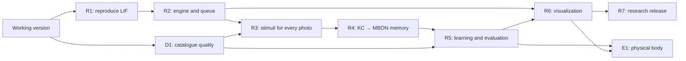

# Fly Estate: next-version roadmap

Updated September 30, 2026. Based on the user’s research document and checked primary sources. Statuses describe the current local implementation. Implemented tools and measured scientific results are tracked separately; unfinished experiments remain open.

## Starting point

The [first version](https://github.com/Perlitten/Fly-Estate/pull/1) includes the React interface, map, 3D connectome, Pure/Cyborg Fly, all-photo processing, personal ratings, apartment duels, filters, import and export.

The initial catalogue snapshot on September 28 contains 121 apartments. It processed 1,327 available photos from 1,427 published URLs. Five listings have unavailable photos; 49 apartments with photos pass the initial rules. It started without personal ratings.

The anatomical view uses 139,248 annotated neurons. The rate baseline retains a fixed positive matrix and a learned MBON/CX readout. A persistent 8,991-neuron LIF worker now processes apartment photos and saves positive KC→MBON memory from real choices. Fully simulated apartments can use its learned spiking readout. See [README](../README.md) and the [learning protocol](LEARNING.md).

**R1 completed September 28:** upstream sources and data are pinned, the original taste response and olfactory learning protocol were reproduced, and runtime, memory and sustained activity were measured. [Report and figures](../reports/lif-baseline.md), [reproduction instructions](../research/README.md). R2/R3 connect the edited subgraph to apartment photos; R4/R6 now connect positive human choices to persistent memory and actual before/after recordings. R5 has a small held-out pilot; a larger prospective benchmark remains open.

## Research foundation

| Component            | Decision for Fly Estate                                                                                                                                                                                                                                                                                                                   |
| -------------------- | ----------------------------------------------------------------------------------------------------------------------------------------------------------------------------------------------------------------------------------------------------------------------------------------------------------------------------------------- |
| Shiu model           | Reproduce the original LIF calculation in Brian2, then integrate it through our own adapter. The repository provides v783 data; its default configuration uses v630. Select the version explicitly. [Repository](https://github.com/philshiu/Drosophila_brain_model), [paper](https://www.nature.com/articles/s41586-024-07763-9).        |
| fly-api              | Use the demos and research scripts as integration source material. Treat `FlyEnv`, `stimulate_neurons` and `save_weights` in the supplied document as sketches of our adapter interface. [Repository](https://github.com/dtch1997/fly-api).                                                                                               |
| Learning             | First reproduce fly-api’s published olfactory→MB experiment on a subgraph of 8,991 LIF neurons. Its authors describe stabilizing structural edits, an artificial KC→MBON gain and simplified LTD. Record all modifications in the experiment log. [Report](https://github.com/dtch1997/fly-api/blob/main/experiments/learning/report.md). |
| Readout and movement | Define valence using selected MBON types and an explicit protocol. The fly-api demo uses an engineered movement controller. Apartment selection needs its own criteria and readout polarity validation. [Navigation report](https://github.com/dtch1997/fly-api/blob/main/experiments/navigation/report.md).                              |
| Resources            | Measure runtime, RSS, data size and spike counts on this computer. Treat the original document’s RAM and speed ranges as hypotheses to measure. Start with one worker.                                                                                                                                                                    |

Upstream revisions checked when creating this plan:

- fly-api: [`a6ad07a810b1a43cd0356149c07b32105eb46d2a`](https://github.com/dtch1997/fly-api/tree/a6ad07a810b1a43cd0356149c07b32105eb46d2a).
- Drosophila_brain_model: [`91bdd1e7dcf193f3e7ca5a8933497fcef63b7960`](https://github.com/philshiu/Drosophila_brain_model/tree/91bdd1e7dcf193f3e7ca5a8933497fcef63b7960).

## Current sequence and status

**Assistant teaching, September 30:** the user authorized assistant supervision using a [specific apartment brief](TEACHER_BRIEF.md). All 385 photos of 32 new adverts were inspected. Twenty-two training reviews published memory revision 37: two positive galleries, eleven negatives and nine pending confirmation. The two positives supplied 19 new reward episodes; 12,636 connections changed relative to the previous memory. Four separate groups carry evaluation-only assistant labels. The existing 15 human comparisons are unchanged and remain 15 of the 50-choice personal-data target. Assistant imitation and personal agreement must be reported separately.

**Measured assistant result:** [six-arm held-out pilot](../reports/assistant-teaching-pilot.md), 2,069.64 seconds and 1,269 LIF inference episodes. Three decisive test ratings: learned LIF AUC 0.00, fixed LIF 0.50, rewired control 1.00. The observed ordering is worse for learned memory; no gain is established. The curated assistant cohort is too small to measure personal recommendation quality and its reviews were drafted before formal reservation. A fresh prospectively collected human study, sensory specificity and aversive circuitry remain open.

| Phase                                | Current status                                                             | Dependencies                       | Observable result / remaining gate                                                                                            |
| ------------------------------------ | -------------------------------------------------------------------------- | ---------------------------------- | ----------------------------------------------------------------------------------------------------------------------------- |
| R1. Reproduction and resources       | Completed September 28                                                     | Current version                    | [Versions, IDs, original responses and memory/runtime profile](../reports/lif-baseline.md)                                    |
| D1. Catalogue quality and sources    | Implemented for exact identities; ambiguous duplicates open                | Current import                     | Read the Bazaraki map without importing galleries; analyze one apartment on demand; freshness, source history and reimport    |
| R2. Spiking engine and queue         | Implemented                                                                | R1                                 | Background LIF computation, durable jobs, recovery and checkpoints                                                            |
| R3. Sensory inputs and every photo   | Implemented; broader sensory validation open                               | R2, D1                             | Versioned Pure/Cyborg stimuli, all-photo episodes, mean/outdoor aggregation and provenance                                    |
| R4. KC→MBON memory                   | Positive memory implemented; aversive circuitry open                       | R1, R3                             | Saved bounded reinforcement, undo and actual weight changes; negative polarity needs a separate circuit decision              |
| R5. Personal learning and evaluation | Evaluation tools implemented; human data collection open                   | R4, D1                             | Six model arms, prospective reservation, frozen design, grouping, uncertainty, ranking and resources; collect 50 real choices |
| R6. Learning visualization           | Implemented; session restoration demonstration open                        | R2–R5                              | Actual spikes, before/after memory, map input provenance and full session ZIP                                                 |
| R7. Research release                 | Local setup and release procedure implemented; final research release open | R5, R6                             | [Reproducible release procedure](RELEASE.md); publish the prospective measurement after collecting feedback                   |
| E1. Fly body / NeuroMechFly          | After the core release                                                     | R5, R6 and acceptable compute cost | A separate physical environment with a traceable brain/controller connection                                                  |

## Acceptance criteria

### R1 — reproduction and resource profile

Status: complete as an exploratory reproduction; three taste trials per condition, not the paper’s 30. Results include three learning seeds, gain sensitivity and edited/unedited stability controls. See the [measured report](../reports/lif-baseline.md) for the protocol and limitations.

- Pin upstream SHAs, Python/Brian2 and data configuration. Match v783 root IDs against current annotations; publish matched and missing counts.
- Report neurons, directed neuron pairs and total synapses separately. Record connection thresholds, weight signs, delays, units and structural edits.
- Reproduce original control stimuli and the learning experiment; record spontaneous/sustained activity, KC sparsity and sensitivity to readout gain.
- Measure first/repeated startup, episode runtime and peak memory. Select the full graph or an explicitly labeled subgraph for interactive use based on these measurements.
- Artifacts: `research/upstream-manifest.json`, a run protocol, `reports/lif-baseline.md` and machine-readable results.

### D1 — catalogue and sources

Status: map browsing, source refresh and conservative import consolidation implemented. The map reads search/map summaries and thumbnails. It downloads a full gallery only after **Analyze this apartment**; ordinary search does not bulk-import apartments. Exact source points and approximate area centres remain distinct. Requests are sequential, with a 0.8 s pause and a 15-minute cache; explicit refresh requests a new snapshot. HTTP 403/429 is shown separately from layout/read errors. A source refresh records an explicit 404/410 as removed; a timeout or block does not establish removal.

- [x] Canonical source URLs and exact full-gallery duplicates (at least two photos, matching city/area/bedrooms/size) consolidate during import, preserving the canonical ID and its choices. Stored image bytes are content addressed. Source aliases, dates, gallery hashes and download outcomes are retained.
- [x] Reimport updates current fields, records price/availability/gallery history, refreshes photos even when their URLs stay the same and retains prior cached images on download failure. **Source & freshness** exposes the check date and refresh action.
- [x] Internal/total/unknown area semantics and separate balcony size/shelter provenance. Unspecified area type and shelter remain unknown.
- [x] Keep owner contacts outside the catalogue. Retain every available image and report failed downloads.
- [x] Investigate official XML access: the checked [Bazaraki property XML guide](https://www.bazaraki.com/business-xml-guide/?rubric_id=3528) and [site rules](https://www.bazaraki.com/about/rules/) describe advertiser publishing/updating. This is evidence about an input feed, not evidence of a public market export. No market export was identified on those pages.
- [ ] Review near-duplicate galleries and already-stored ambiguous duplicates before consolidating their historical choices. One common stock photo never causes a catalogue merge; evaluation groups conservatively keep all listings sharing an identical photo together.
- [ ] Integrate an official market export if one becomes available with appropriate access. Current connector reads public pages; external source availability remains an operational dependency.

### R2 — engine interface and durable queue

Status: implemented; connected to per-photo analysis and 3D spike playback, with a labelled spiking-memory verdict when current results and sufficient choices are available, and a rate fallback. `OlfactoryMBEngine` reimplements the R1 LIF model in NumPy on the edited 8,991-neuron olfactory→MB subgraph, with one persistent worker (R1 resource profile). With identical scripted drive it produced exactly the same spikes as the pinned Brian2 kernel (80,463 and 85,975 spikes over 300 ms; 0 differing neurons). The [parity replay](../reports/results/engine_parity.json) of the R1 conditioning protocol selects identical odors and plastic synapses and matches R1 within stated tolerances: odor A suppression 98.9% (R1 98.9%), odor B change −3.8% (R1 −6.5%), 5,482 changed synapses (R1 5,483), pre-conditioning MBON spikes 3,732 (R1 3,764). Episode 0.75 s mean including washout; startup 0.1 s. Worker restart after a forced kill resumed an interrupted job without recomputing finished photos. R3 has replaced the provisional `photo-orn-v0` adapter.

- Introduce `SimulationEngine` for running episodes, reading activity, reinforcement and checkpoints. Encapsulate actual upstream calls in an adapter.
- Persist jobs: queue, per-photo progress, cancellation, completion and recovery after restart.
- Separate the HTTP server, CLIP and Brian2 worker; limit workers according to R1. Keep the interface accessible during computation.
- Cache keys include photo SHA, stimulus parameters, engine version, settings and checkpoint hash. Label activity produced with older weights by its version.
- Save atomically. Checkpoints contain weights, seed, parameters, IDs and episode history. Compare restored outputs using identical stimuli.

### R3 — photos, space and balconies

Status: partially implemented. Both codecs replace `photo-orn-v0` and share one layout on the 22 ORN classes: channels 0–15 carry the photo, 16–21 the listing (price ÷ hard limit, closeness to the preferred point, stated floor area, balcony, its stated size and shelter; unknown values drive 0 Hz and are marked unknown). `photo-pure-v1` pools the 8 × 8 retina into a 4 × 4 Rec. 709 luminance grid; `photo-cyborg-v2` subtracts a frozen centre (mean of 1,168 stored CLIP embeddings, identified by SHA-256 and part of the cache key) from the full L2-normalised 512-d CLIP image embedding, renormalises it and projects it through a fixed Gaussian matrix (seed 783). Embeddings are stored per photo SHA; the centre is frozen on the first cyborg run or by `python -m server.embeddings` and replaced only with `--refresh-center`. Every run snapshots codec and brief; the gallery endpoint rebuilds each photo's stimulus and cache key and reports `ready`, `stale`, `queued`, `running`, `error`, `missing` or `unavailable`. The brain sidebar shows per-photo readiness, run/stop, progress and the selected photo's KC, MBON and PAM response. A live cyborg run of 14 photos took about 20 s. Without centring (v1) the shared CLIP component dominated: photo signals of one listing correlated at 0.77; with v2 at 0.02. Mean Jaccard overlap of the active KC sets between that listing's 14 photos: v1 0.80, v2 0.63, Pure 0.87; the same stimulus under five seeds overlaps at 0.975, so the differences come from the photos (the six listing channels are shared by design). Mean/outdoor photo aggregators and a current-weight spiking readout are implemented; broader validation remains open.

- **Every available photo** has its own stimulus and neural result. Recompute against the current checkpoint after memory changes; show gallery readiness.
- Pure: define the visual input grid/sampling, IDs, frequencies and duration. Cyborg: add the complete CLIP embedding with a fixed projection into selected input channels. Document both adapters as artificial.
- Floor area, room to fly and low clutter are positive user preferences. A balcony/loggia, its size and shelter are priority signals of outdoor space.
- Photos estimate spaciousness and outdoor space visually. Accept square-meter values only from confirmed source fields; mark unknown values explicitly.
- Compare averaging with an aggregator that preserves strong balcony evidence from a single outdoor image. Select aggregation using training/validation data.
- Price and location are stimulus features. Store human reinforcement separately; automatic budget/space preferences must have explicit provenance.
- Document the engineered projection of preferred area and distance; reflect geographical accuracy in the card.

### R4 — dopamine and mutable memory

Status: positive reinforcement and durable memory implemented September 30. Single likes and pairwise winners reinforce every unique gallery photo with one bounded gallery dose. Choices and journal events commit together; deterministic rebuilding from the base handles editing, clearing, retries and restart. Only declared KC→MBON weights change. The [three-seed photo controls](../reports/photo-memory-controls.md) measured positive plasticity and broad generalization, not selective visual taste. Negative circuits and polarity controls remain open. See [protocol and checks](LEARNING.md).

- Start with reproducible positive reinforcement. Record active KCs, DANs and changed KC→MBON weights for each episode.
- Introduce negative reinforcement through selected circuits/compartments with checked polarity; stimulation rates remain nonnegative. PAM/PPL1 mapping and MBON asymmetry require a separate model decision.
- A neutral choice in plasticity mode stores the user rating with zero reinforcement. Pairwise choices have explicit winner, alternative and tie protocols.
- [x] Add an isolated [photo-conditioning control runner](../research/README.md#isolated-photo-conditioning-controls): matched A/B presentation, paired reward, PAM-only unpaired reward, no reward, several seeds and a checkpoint encode/decode probe. It does not publish experimental weights or create user choices.
- [x] Run photo controls under Pure with seeds 0, 1 and 2. Paired A reward changed 11,140–11,248 KC→MBON connections and reduced A/B MBON responses by 10.5%/10.3%; no reward and separate PAM-only reward changed zero. Every checkpoint encode/decode probe matched exactly, with zero changes outside plastic connections. The similar A/B suppression shows broad generalization. [Measured report](../reports/photo-memory-controls.md).
- [ ] Reproduce these control effects after a physical application restart and session transfer. Establish stimulus specificity with a broader photo protocol; the earlier R1 odor reproduction and personal gallery probe are separate evidence.
- Updates are restricted to the declared synapses. Session history links ratings, photos, stimuli and checkpoints; processing the same event again is idempotent.

### R5 — learning and quality measurement

Status: six-arm retrospective pilot measured; prospective protocol implemented; new human feedback still needed. The [six-arm report](../reports/learning-six-arm-pilot.md) uses the same 15 real choices and three held-out comparisons as the [earlier four-arm pilot](../reports/learning-pilot.md). All six models agreed with 1 of 3 choices under current Pure inference. Saved reinforcement used Cyborg, so the learned arm measures transfer between codecs. All test comparisons form one connected component; independent evidence is limited and no improvement was established. Reusing this split adds no new human evidence.

- [x] Select pairs by exposure, clear early contrasts and later score uncertainty, with area/price/bedroom diversity. Same-photo apartment groups are not paired against themselves.
- [x] Retrospective holdout: reserve approximately 20% of reviewed apartment groups; exclude touching comparisons and held-out photos from reinforcement and readout fitting.
- [x] **Learning → Reserve unseen apartments**: choose up to ten previously unreviewed groups across areas before feedback. Freeze the checkpoint, base, training choices, brief, gallery hashes, CLIP centre and model source hashes. Groups previously exposed to journal reinforcement cannot enter this cohort. Reserved apartments and connected duplicate groups remain excluded from training after evaluation.
- [x] **Evaluate frozen model** snapshots at least three evaluation choices. Changed model code is rejected; changed brief, mode, apartment fields/gallery or unfrozen comparison opponents cannot label the original frozen experiment. Retrying a failed job reuses the frozen snapshot. Evaluation restores the live checkpoint and never publishes experimental weights.
- [x] Compare price/distance, direct full-embedding CLIP + logistic readout, rate + readout, fixed LIF + readout, learned LIF + readout and a KC→MBON rewired LIF control. Rewiring uses directed double-edge swaps, preserving KC out-degree, MBON in-degree and per-KC weight multiset; unrelated connections stay fixed. Store seed, swap count and graph hash.
- [x] Report AUC when both classes exist, decisive-pair agreement, ties, precision@k over explicitly rated distinct groups, photo coverage, per-photo mean/p95 latency and worker peak RSS. Label RSS as the lifetime high-water mark. Connected comparison components define bootstrap resampling units; fewer than three components yield no bootstrap interval. Wilson intervals remain descriptive.
- [x] Download the selected evaluation as machine-readable JSON.
- [x] Assistant review provenance, atomic gallery/field validation, reasons and observations for every photo, stale-review exclusion and human-rating priority. Assistant positives require an individual map pin south of A1/A6 and at least 300 m from the main carriageway geometry. Unknown appliances, parking or road coverage remain unconfirmed.
- [x] Actually teach the current memory from 22 assistant reviews. Keep four other groups excluded from training and measure all six arms using the frozen checkpoint. Their reviews were drafted before formal reservation, so this exercises frozen evaluation with held-out assistant labels; it does not close the prospective human-study gate.
- [x] Measure the six arms on existing choices: 202 unique photos per spiking arm, 606 inference episodes, 512.59 s total. Worker lifetime peak RSS was 128.4 MB, excluding API/CLIP/desktop. Ambient use and caching prevent interpreting this as an isolated hardware benchmark. Reports expose inference mode and saved reinforcement modes.
- [ ] Collect at least 50 diverse **real** choices. The current local record contains 15 comparisons; do not fabricate the missing 35. Consider 100–500 only after quality/runtime saturation is measured.
- [ ] Run and publish prospective measurements on newly rated reserved apartments, including six arms and uncertainty. A retrospective rerun does not add independent evidence. If tuning is needed, use a validation set and reserve a fresh final cohort.
- [ ] Choose the interactive sensory/aggregation mode from measured quality and resources; document any tuning before the final cohort is reserved.

### R6 — visual quality and traceability

Status: photo analysis, actual spikes, changed connections, matched before/after probes, map input provenance and full-session export/offline restoration implemented. **Analyze in 3D** follows every photo using actual LIF spike counts in 25 ms bins; **Replay analysis** supports pause/scrub/photo selection. FlyWire IDs map the simulated 8,991 neurons onto the anatomical view; other neurons stay dim. **Learned memory** shows up to 256 actual changes. **Learning** shows an anatomical change map, before/after measurements, revision history and the held-out report. Full-session ZIP stores SQLite snapshots, photos, embeddings, recordings, cohort protocol and all checkpoints, with checksums and model versions. Offline restore validates the archive and checkpoint before replacement and retains the previous session for recovery; an end-to-end transfer demonstration remains open.

- Preserve the application’s current design and add a taste history: photo, stimulus, active KC/DAN/MBON neurons, changed connections and before/after learning responses.
- Distinguish anatomical graph, simulated subgraph, spikes and activity rates in 3D. Frames expose time, units, checkpoint and cache status.
- Offer gallery/individual-photo selection and Pure/Cyborg and old/new-memory comparisons. Show photo coverage and the source of balcony size.
- [x] Map disclosure shows price, distance, space, balcony and shelter input magnitudes, missing fields and source coordinate accuracy. These are engineered stimulus inputs, not measured causal contributions. Marker movement is explicitly a readout illustration.
- [x] Full-session ZIP export and offline exact checkpoint restoration, alongside lightweight JSON choice export. Export waits for source imports to finish; restoration requires the API/worker to be stopped and compatible model code.
- [ ] Demonstrate archive transfer to a second computer, compare the restored checkpoint and replay, and record that result. Archive validation in code alone is not evidence of a successful transfer.

### R7 — research release

Status: local setup, source attribution and the [release/demo procedure](RELEASE.md) are documented. Setup prepares the persistent LIF subgraph; catalogue/gallery seeding is opt-in (`--seed`). This is a local research build, not the final measured release.

- [x] Pinned upstream/model sources, dependency lockfile, default local startup and explicit engine/adapter/plasticity limitations.
- [x] Document the existing real session and report without committing personal databases/photos. Provide exact-session export/restore commands and a map → apartment → every photo → memory → evaluation demo sequence.
- [ ] Complete the second-computer restoration demonstration and publish a prospective report with new human feedback and resources. Confirm frontend build and selected research release revision.
- [ ] Decide whether to offer a public service, with authentication, separate user state and compute budgets. Public hosting remains a separate product decision.

### E1 — optional physical body

Connect NeuroMechFly/MuJoCo after R5/R6 and resource measurements. Start with a separate virtual environment, a control signal and before/after learning controls. The geographical map and physical arena use different scales. Physical flight and reconstructing a real apartment from photos require their own models and data.

## Next concrete step

**R5: reserve unseen apartments, collect real choices and measure the frozen model.** The tools for reservation, six-arm comparison, component uncertainty, ranking/resources and portable memory are implemented. The next evidence requires human feedback: collect at least 50 diverse choices, rate the reserved groups and publish a prospective report. Validate aversive circuitry and polarity separately. E1 remains deferred until those measurements justify a physical body experiment.

## GitHub tasks

[Milestones and target dates](https://github.com/Perlitten/Fly-Estate/milestones).

- [R1: Reproduce Shiu/fly-api LIF and measure resources](https://github.com/Perlitten/Fly-Estate/issues/2).
- [D1: Improve the catalogue, galleries, deduplication and source access](https://github.com/Perlitten/Fly-Estate/issues/3).
- [R2: Add SimulationEngine, a durable queue and checkpoints](https://github.com/Perlitten/Fly-Estate/issues/4).
- [R3: Feed every photo, space and balcony into the spiking model](https://github.com/Perlitten/Fly-Estate/issues/5).
- [R4: Add dopamine-dependent KC→MBON plasticity and saved memory](https://github.com/Perlitten/Fly-Estate/issues/6).
- [R5: Organize personal learning and held-out apartment evaluation](https://github.com/Perlitten/Fly-Estate/issues/7).
- [R6: Show spikes, memory changes and before/after learning responses](https://github.com/Perlitten/Fly-Estate/issues/8).
- [R7: Prepare a reproducible research release and report](https://github.com/Perlitten/Fly-Estate/issues/9).
- [E1: Connect NeuroMechFly/MuJoCo and a physical environment](https://github.com/Perlitten/Fly-Estate/issues/10).
