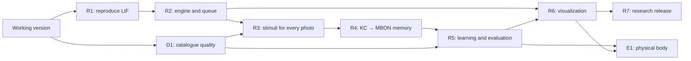

# Fly Estate: next-version roadmap

Updated September 28, 2026. Based on the user’s research document and checked primary sources. This document is a **work plan**. Dates are tentative targets; each research phase depends on the results of the previous phase.

## Starting point

The [first version](https://github.com/Perlitten/Fly-Estate/pull/1) includes the React interface, map, 3D connectome, Pure/Cyborg Fly, all-photo processing, personal ratings, apartment duels, filters, import and export.

The initial catalogue snapshot on September 28 contains 121 apartments. It processed 1,327 available photos from 1,427 published URLs. Five listings have unavailable photos; 49 apartments with photos pass the initial rules. It started without personal ratings.

The current engine uses 139,248 annotated neurons, a fixed positive connection matrix and a learned MBON/CX readout. The next version adds spiking dynamics and mutable KC→MBON memory. See [README](../README.md) for the working model.

**R1 completed September 28:** upstream sources and data are pinned, the original taste response and olfactory learning protocol were reproduced, and runtime, memory and sustained activity were measured. [Report and figures](../reports/lif-baseline.md), [reproduction instructions](../research/README.md). The selected integration target is one persistent worker for the explicitly edited 8,991-neuron olfactory→MB subgraph. This research engine is not yet connected to apartment photos or personal ratings.

## Research foundation

| Component | Decision for Fly Estate |
| --- | --- |
| Shiu model | Reproduce the original LIF calculation in Brian2, then integrate it through our own adapter. The repository provides v783 data; its default configuration uses v630. Select the version explicitly. [Repository](https://github.com/philshiu/Drosophila_brain_model), [paper](https://www.nature.com/articles/s41586-024-07763-9). |
| fly-api | Use the demos and research scripts as integration source material. Treat `FlyEnv`, `stimulate_neurons` and `save_weights` in the supplied document as sketches of our adapter interface. [Repository](https://github.com/dtch1997/fly-api). |
| Learning | First reproduce fly-api’s published olfactory→MB experiment on a subgraph of 8,991 LIF neurons. Its authors describe stabilizing structural edits, an artificial KC→MBON gain and simplified LTD. Record all modifications in the experiment log. [Report](https://github.com/dtch1997/fly-api/blob/main/experiments/learning/report.md). |
| Readout and movement | Define valence using selected MBON types and an explicit protocol. The fly-api demo uses an engineered movement controller. Apartment selection needs its own criteria and readout polarity validation. [Navigation report](https://github.com/dtch1997/fly-api/blob/main/experiments/navigation/report.md). |
| Resources | Measure runtime, RSS, data size and spike counts on this computer. Treat the original document’s RAM and speed ranges as hypotheses to measure. Start with one worker. |

Upstream revisions checked when creating this plan:

- fly-api: [`a6ad07a810b1a43cd0356149c07b32105eb46d2a`](https://github.com/dtch1997/fly-api/tree/a6ad07a810b1a43cd0356149c07b32105eb46d2a).
- Drosophila_brain_model: [`91bdd1e7dcf193f3e7ca5a8933497fcef63b7960`](https://github.com/philshiu/Drosophila_brain_model/tree/91bdd1e7dcf193f3e7ca5a8933497fcef63b7960).

## Sequence and schedule

| Phase | Target | Dependencies | Observable result |
| --- | --- | --- | --- |
| R1. Reproduction and resources | Completed September 28 | Current version | [Versions, IDs, original responses and memory/runtime profile](../reports/lif-baseline.md) |
| D1. Catalogue quality and sources | By October 11 | Current import | Apartment/photo deduplication, freshness, reimport and an access path for Bazaraki |
| R2. Spiking engine and queue | October 5–11 | R1 | Background LIF computation with durable jobs and saved state |
| R3. Sensory inputs and every photo | October 12–18 | R2, D1 | Versioned stimuli for each photo, space, balcony and location |
| R4. KC→MBON memory | October 19–25 | R1, R3 | Selected synapses change after reinforcement; save and restore memory |
| R5. Personal learning and evaluation | October 26 – November 1 | R4, D1 | Pilot ratings, held-out apartments, metrics and model comparisons |
| R6. Learning visualization | November 2–8 | R2–R5 | Photo → actual model spikes → memory change → selection result |
| R7. Research release | November 9–15 | R5, R6 | Reproducible startup, report and demonstration with saved memory |
| E1. Fly body / NeuroMechFly | After the core release | R5, R6 and acceptable compute cost | A separate physical environment with a traceable brain/controller connection |

## Acceptance criteria

### R1 — reproduction and resource profile

Status: complete as an exploratory reproduction; three taste trials per condition, not the paper’s 30. Results include three learning seeds, gain sensitivity and edited/unedited stability controls. See the [measured report](../reports/lif-baseline.md) for the protocol and limitations.

- Pin upstream SHAs, Python/Brian2 and data configuration. Match v783 root IDs against current annotations; publish matched and missing counts.
- Report neurons, directed neuron pairs and total synapses separately. Record connection thresholds, weight signs, delays, units and structural edits.
- Reproduce original control stimuli and the learning experiment; record spontaneous/sustained activity, KC sparsity and sensitivity to readout gain.
- Measure first/repeated startup, episode runtime and peak memory. Select the full graph or an explicitly labeled subgraph for interactive use based on these measurements.
- Artifacts: `research/upstream-manifest.json`, a run protocol, `reports/lif-baseline.md` and machine-readable results.

### D1 — catalogue and sources

- Merge duplicate listings and identical photos; retain source, date, gallery version and the download outcome for each URL.
- Store known area semantics: internal/total/unknown. Balcony size and shelter are separate fields with source references.
- For Bazaraki, first establish an available reading method and the purpose of its XML feed. Add official access/export when available; use the existing import for open pages. Show source blocking in connector status.
- Reimport updates price and availability, preserves personal ratings and accounts for changed photos.
- Keep owner contact details outside the recommendation catalogue. Preserve every available image in the gallery and show download problems.

### R2 — engine interface and durable queue

- Introduce `SimulationEngine` for running episodes, reading activity, reinforcement and checkpoints. Encapsulate actual upstream calls in an adapter.
- Persist jobs: queue, per-photo progress, cancellation, completion and recovery after restart.
- Separate the HTTP server, CLIP and Brian2 worker; limit workers according to R1. Keep the interface accessible during computation.
- Cache keys include photo SHA, stimulus parameters, engine version, settings and checkpoint hash. Label activity produced with older weights by its version.
- Save atomically. Checkpoints contain weights, seed, parameters, IDs and episode history. Compare restored outputs using identical stimuli.

### R3 — photos, space and balconies

- **Every available photo** has its own stimulus and neural result. Recompute against the current checkpoint after memory changes; show gallery readiness.
- Pure: define the visual input grid/sampling, IDs, frequencies and duration. Cyborg: add the complete CLIP embedding with a fixed projection into selected input channels. Document both adapters as artificial.
- Floor area, room to fly and low clutter are positive user preferences. A balcony/loggia, its size and shelter are priority signals of outdoor space.
- Photos estimate spaciousness and outdoor space visually. Accept square-meter values only from confirmed source fields; mark unknown values explicitly.
- Compare averaging with an aggregator that preserves strong balcony evidence from a single outdoor image. Select aggregation using training/validation data.
- Price and location are stimulus features. Store human reinforcement separately; automatic budget/space preferences must have explicit provenance.
- Document the engineered projection of preferred area and distance; reflect geographical accuracy in the card.

### R4 — dopamine and mutable memory

- Start with reproducible positive reinforcement. Record active KCs, DANs and changed KC→MBON weights for each episode.
- Introduce negative reinforcement through selected circuits/compartments with checked polarity; stimulation rates remain nonnegative. PAM/PPL1 mapping and MBON asymmetry require a separate model decision.
- A neutral choice in plasticity mode stores the user rating with zero reinforcement. Pairwise choices have explicit winner, alternative and tie protocols.
- Controls: identical stimuli with/without reinforcement, an unpaired control stimulus and several seeds. Saving and restarting must reproduce the recorded memory effect.
- Updates are restricted to the declared synapses. Session history links ratings, photos, stimuli and checkpoints; processing the same event again is idempotent.

### R5 — learning and quality measurement

- Collect the first 50 real user episodes/choices. Consider 100–500 only after the pilot, accounting for runtime and quality saturation.
- Start with clear contrasts, then select informative pairs while preserving diversity of areas, prices and interiors.
- Before learning, hold out approximately 20% of **apartment groups** formed by duplicates. All images of an apartment and repeated listings stay in one split; exclude comparisons involving held-out apartments from training.
- Freeze weights and reinforcement for held-out evaluation. Use a separate validation split for parameter selection; evaluate finally after fixing the design.
- Metrics: ROC AUC when both classes exist, pairwise accuracy with separate tie handling, precision@k/preference agreement, photo coverage, latency and peak RAM. Report sample counts and uncertainty.
- Compare price/distance rules, CLIP with a simple readout, the current fixed graph, LIF without plasticity, LIF with plasticity and a connectivity-rewired control.
- Publish measured results and compute costs. Select an interactive mode based on quality and resources.

### R6 — visual quality and traceability

- Preserve the application’s current design and add a taste history: photo, stimulus, active KC/DAN/MBON neurons, changed connections and before/after learning responses.
- Distinguish anatomical graph, simulated subgraph, spikes and activity rates in 3D. Frames expose time, units, checkpoint and cache status.
- Offer gallery/individual-photo selection and Pure/Cyborg and old/new-memory comparisons. Show photo coverage and the source of balcony size.
- On the map, show how budget, distance, space and balcony contribute to stimuli. Label marker movement with controller type and signal provenance.
- Add memory restoration and full-session export with versions; confirm successful saving of user changes.

### R7 — research release

- Reproducible setup from pinned versions, an example experimental session with explicit data provenance, saved memory and a final report.
- Document the selected engine, active neurons and limitations of dynamics, sensory adapters, plasticity and apartment sources.
- Demonstrate a new apartment with every photo, before/after learning responses, checkpoint restoration and evaluation with frozen weights.
- Decide on a public service separately, covering user storage, authentication and compute budget. Keep local startup available.

### E1 — optional physical body

Connect NeuroMechFly/MuJoCo after R5/R6 and resource measurements. Start with a separate virtual environment, a control signal and before/after learning controls. The geographical map and physical arena use different scales. Physical flight and reconstructing a real apartment from photos require their own models and data.

## Next concrete step

**R2: introduce the engine interface, a durable queue and versioned checkpoints.** Use one persistent worker for the edited 8,991-neuron subgraph selected in R1. Preserve the current apartment rate engine as the baseline, and distinguish simulated neurons from display-only anatomy. D1 can improve galleries and source quality alongside it. Apartment sensory inputs and plasticity follow in R3/R4.

## GitHub tasks

[Milestones and target dates](https://github.com/Perlitten/Fly-Estate/milestones).

- [R1: Reproduce Shiu/fly-api LIF and measure resources](https://github.com/Perlitten/Fly-Estate/issues/2).
- [D1: Improve the catalogue, galleries, deduplication and source access](https://github.com/Perlitten/Fly-Estate/issues/3).
- [R2: Add SimulationEngine, a durable queue and checkpoints](https://github.com/Perlitten/Fly-Estate/issues/4).
- [R3: Feed every photo, space and balcony into the spiking model](https://github.com/Perlitten/Fly-Estate/issues/5).
- [R4: Add dopamine-dependent KC→MBON plasticity and saved memory](https://github.com/Perlitten/Fly-Estate/issues/6).
- [R5: Organize personal learning and held-out apartment evaluation](https://github.com/Perlitten/Fly-Estate/issues/7).
- [R6: Show spikes, memory changes and before/after learning responses](https://github.com/Perlitten/Fly-Estate/issues/8).
- [R7: Prepare a reproducible research release and report](https://github.com/Perlitten/Fly-Estate/issues/9).
- [E1: Connect NeuroMechFly/MuJoCo and a physical environment](https://github.com/Perlitten/Fly-Estate/issues/10).
