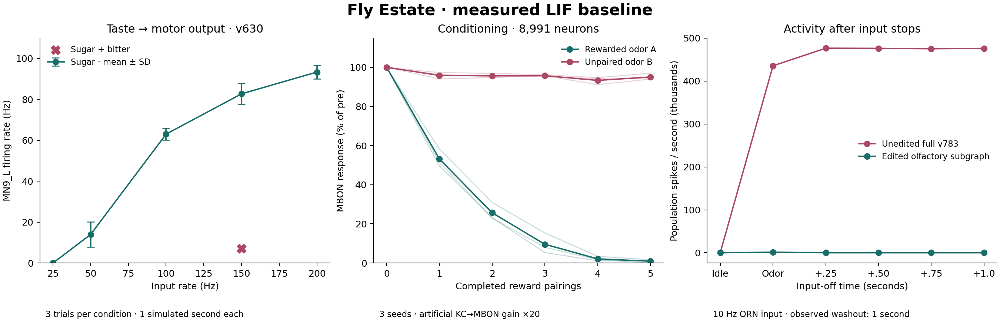

# R1: reproduced LIF baseline and resource measurements

Measured 2026-09-28, on Apple M4 Pro (12 logical CPUs, 24 GiB RAM), macOS-15.7.5-arm64-arm-64bit, Python 3.12.14. One research worker at a time; Cython code generation; no GPU. Other desktop processes may affect these timings; the original September 28 measurement also ran alongside the apartment application.

**R1 is complete as an exploratory reproduction.** This establishes a spiking research baseline. Apartment photos and personal ratings still use the application’s existing rate engine; research plasticity is not connected to the application yet.

## Sources and exact protocol

- [Shiu model](https://github.com/philshiu/Drosophila_brain_model/tree/91bdd1e7dcf193f3e7ca5a8933497fcef63b7960), [published paper](https://www.nature.com/articles/s41586-024-07763-9).
- [fly-api](https://github.com/dtch1997/fly-api/tree/a6ad07a810b1a43cd0356149c07b32105eb46d2a), [taste protocol](https://github.com/dtch1997/fly-api/blob/a6ad07a810b1a43cd0356149c07b32105eb46d2a/demo/track_a_lif.py), [learning protocol](https://github.com/dtch1997/fly-api/blob/a6ad07a810b1a43cd0356149c07b32105eb46d2a/experiments/learning/learning_driver_mb.py).
- Source and dataset SHA256 values: [upstream manifest](../research/upstream-manifest.json). Large upstream files remain in the ignored cache; their original code is unchanged.
- Runtime adaptations: replace the learning driver’s hardcoded annotation path with our pinned v3.1.0 TSV; seed Brian2 explicitly; use one worker; set dt to 0.1 ms; measure build/run durations and RSS. Recompute taste rates from spike files to include silent trials where the upstream pivot table emits NaN. Preserve the raw upstream output in the cache.
- Brian2 2.9.0 failed on NumPy 2.5.3 (`ndarray.ptp` removed). Use the separate NumPy 1.26.4 research environment; the application’s NumPy environment is preserved. [Failure record](results/failed_numpy2.json), [dependency lock](../research/requirements-lock.txt).

The LIF equations and constants follow the upstream model: rest/reset −52 mV, threshold −45 mV, membrane time constant 20 ms, synaptic decay 5 ms, refractory period 2.2 ms, transmission delay 1.8 ms and weight 0.275 mV per signed anatomical synapse. External Poisson stimulation uses the upstream factor 250 and zero refractory period for stimulated targets. Weight signs are inherited predictions in the supplied connectivity data, not validated receptor-specific signs.

## Connectome audit

| Data | Neurons | Directed pairs | Anatomical synapses | Sign/threshold |
| --- | ---: | ---: | ---: | --- |
| Shiu v630 taste experiment | 127,400 | 14,687,178 | 52,793,639 | inherited ± signs; count ≥1 |
| Shiu v783 full model | 138,639 | 15,091,983 | 54,492,922 | inherited ± signs; count ≥1 |
| v783 olfactory→MB experiment | 8,991 | 791,613 | subset of the full data | four explicit structural edits |
| Current apartment application | 139,248 | 2,700,429 | 34,152,544 | positive normalized weights; count ≥5 |

All upstream connection indices match their root IDs. Both upstream datasets contain zero self-connections and zero duplicate pairs. v783 has 9,059,302 positive and 6,032,681 negative directed pairs. Of our 139,248 annotation IDs, **138,625 match v783, 623 are absent from its completeness table**, and 14 upstream IDs lack a current annotation. Do not silently equate the displayed anatomy with simulated neurons. v630 taste IDs remain a distinct version; no v630→v783 conversion is claimed.

The learning subgraph matches 8,991 neurons: 2,279 ORNs, 429 ALLNs, 685 ALPNs, 5,177 KCs, 2 APLs, 96 MBONs, 307 PAMs and 16 PPL1s. [Full audit and missing-ID lists](results/connectome-audit.json).

## Taste response

Original v630 taste protocol, **three one-second trials per condition** rather than the paper’s 30. MN9_L responds to sugar input at 25/50/100/150/200 Hz with 0/14/63/82.67/93.33 Hz. At 150 Hz, bitter produces 0 Hz, water 6 Hz, and sugar+bitter 7 Hz: **91.5% suppression** relative to sugar alone. Variability across the three trials is recorded as population SD, not a confidence interval. [Measured rates](results/taste_s0_n3.json).

This reproduces the qualitative dose response and bitter suppression. It is not a full statistical replication of the original paper.

## Conditioning and gain sensitivity

Six disjoint ORN classes per odor, 500 Hz input, 0.5 s episodes plus 0.15 s washout; PAM reward drive 60 Hz; five rewarded A episodes interleaved with unpaired B; two pre/post presentations; η=0.5; active KC threshold ≥1 spike; PAM gate ≥1 Hz. Brian2 and odor selection use seeds 0/1/2. G=20 is the explicit artificial KC→MBON gain; G=1 is a sensitivity arm at seed 0.

| Seed | Gain | A pre → post spikes | A suppression | B change | Changed pairs |
| --- | ---: | ---: | ---: | ---: | ---: |
| 0 | 20 | 3764 → 41 | 98.91% | -6.46% | 5,483 |
| 1 | 20 | 3490 → 0 | 100.00% | -3.79% | 4,051 |
| 2 | 20 | 4246 → 70 | 98.36% | -7.72% | 6,455 |
| 0 | 1 | 40 → 42 | -2.47% | -22.41% | 1,894 |

There are 62,261 candidate KC→MBON pairs. Every run changes **zero connections outside that declared set**. Reduced response to A is a readout of this artificial reward protocol; lower total MBON output does not independently prove appetitive polarity. Checkpoints store before/after weights in volts, pre/post indices and root IDs. Their hashes are recorded; they are research weight snapshots, not complete restartable application checkpoints.

Structural edits are explicit: DAN fast outputs zeroed, KC→KC zeroed, ORN afferents zeroed, positive ALLN outputs zeroed. The source selects 50,155 / 293,762 / 65,429 / 37,892 pairs respectively; these masks overlap. G=20 also modifies KC→MBON efficacy. Uniform episodic LTD is not compartment-specific dopamine biology. Human apartment feedback has not been used in these experiments.

### KC sparsity and repeatability

Pre-episode active fraction, with stated thresholds:

| Seed | Gain | KC ≥1 spike | KC ≥2 spikes | A repeat Jaccard (≥1) | A/B Jaccard (≥1) |
| --- | ---: | ---: | ---: | ---: | ---: |
| 0 | 20 | 9.29% | not recorded | 0.971 | 0.057 |
| 1 | 20 | 8.55% | 8.16% | 0.935 | 0.076 |
| 2 | 20 | 9.65% | 9.16% | 0.982 | 0.033 |
| 0 | 1 | 3.37% | 3.30% | 0.975 | 0.018 |

The ≥2-spike instrumentation was added after the first G=20 run, so that value is missing for seed 0. Report threshold/gain dependence explicitly; do not copy claims of perfect repeatability or a single sparsity percentage from another environment. Generalization probes run only after training in the upstream driver: their raw response and weight-depression trace are recorded, but there is no matched naive-probe baseline here for estimating a generalization suppression percentage.

## Spontaneous and sustained activity

Initial idle lasts 0.5 s; one ORN_DA1 class (126 input neurons) receives 10 Hz for 0.5 s, followed by four 0.25 s input-free windows. Stability uses a vectorized PoissonGroup adapter with the same input amplitude; taste reproduction uses the original per-neuron PoissonInput. Only the subgraph receives the four edits in the edited arm; its gain is 1.

| Run | Initial idle spikes | Final washout spikes/s | Active neurons in final window | KC ≥2 active |
| --- | ---: | ---: | ---: | ---: |
| stability_full_raw_s0 | 0 | 476,128 | 8,121 | 63.9% |
| stability_subgraph_raw_s0 | 0 | 343,420 | 5,018 | 68.8% |
| stability_subgraph_edited_s0 | 0 | 0 | 0 | 0.0% |

The unedited model is silent before input but develops sustained activity that remains present throughout the measured one-second washout. The edited olfactory subgraph returns to silence. The experiment does not establish infinite persistence or whole-brain stability after the subgraph edits.

## Compute cost

Seconds and **GiB** (2³⁰ bytes); RSS sampled every 50 ms. Worker peak excludes the HTTP server, application CLIP model and the profiling parent. Process-tree peaks including compiler children are also in the JSON records. Compilation cache is shared between serial runs; first calls in later runs may already have warm kernels.

| Run | Total wall s | First build s | First run s | Repeat median s | Worker peak GiB |
| --- | ---: | ---: | ---: | ---: | ---: |
| taste_s0_n3 | 884.95 | 15.16 | 37.93 | 29.554 | 2.71 |
| learning_g20_s0 | 39.64 | 7.90 | 17.67 | 0.380 | 2.01 |
| learning_g20_s1 | 15.40 | 5.00 | 0.50 | 0.297 | 1.68 |
| learning_g20_s2 | 11.14 | 1.52 | 0.44 | 0.307 | 1.83 |
| learning_g1_s0 | 11.13 | 1.47 | 0.40 | 0.306 | 1.79 |
| stability_full_raw_s0 | 10.56 | 1.40 | 3.18 | 0.739 | 1.90 |
| stability_subgraph_raw_s0 | 4.63 | 1.55 | 0.35 | 0.149 | 1.80 |
| stability_subgraph_edited_s0 | 3.69 | 1.35 | 0.30 | 0.092 | 1.66 |

The taste script rebuilds each network and repeatedly generates input kernels. Its trial timings include preparation/compilation inside `Network.run` and are **not steady-state episode latency**. Learning reuses a compiled network: its repeat median covers a full 0.5 s stimulus plus 0.15 s washout. Stability repeat timings mix 0.25/0.5 s windows; inspect individual durations in the JSON. The first taste run began with an empty dedicated Cython cache; later protocols reused it. These are local measurements, not a hardware-independent promise.

## R2 integration decision

1. Start with one persistent research worker using the **explicit 8,991-neuron edited olfactory→MB subgraph**. Keep the full graph as a separate offline research mode until a stable stimulus regime is established. Full v783 fits local RAM, but the sustained activity makes raw photo stimulation unsuitable without further work.
2. Prepare the signed subgraph once, reuse the compiled network, and avoid loading the full 15-million-pair table for every episode. Preserve original anatomical weights separately from structural edits, readout gain and learned memory.
3. Keep the existing apartment rate engine as the application baseline. Add a versioned `SimulationEngine`, durable queue and traceable checkpoint before sending apartment stimuli into LIF. Explicitly distinguish simulated neurons from display-only anatomy.
4. Treat G=20 and uniform LTD as research settings. Select apartment valence, compartments and sensory projections in R3/R4; this odor reproduction does not establish apartment taste or flight behavior.

## Reproduce

See [research setup and run instructions](../research/README.md). Run `research.bootstrap`, `research.audit`, `research.suite`, then `research.analyse` in the separate locked environment. Completed successful runs are preserved; cached numerical outputs allow regenerating this report and figure without rerunning simulations. [Machine-readable metrics](results/metrics.json).
